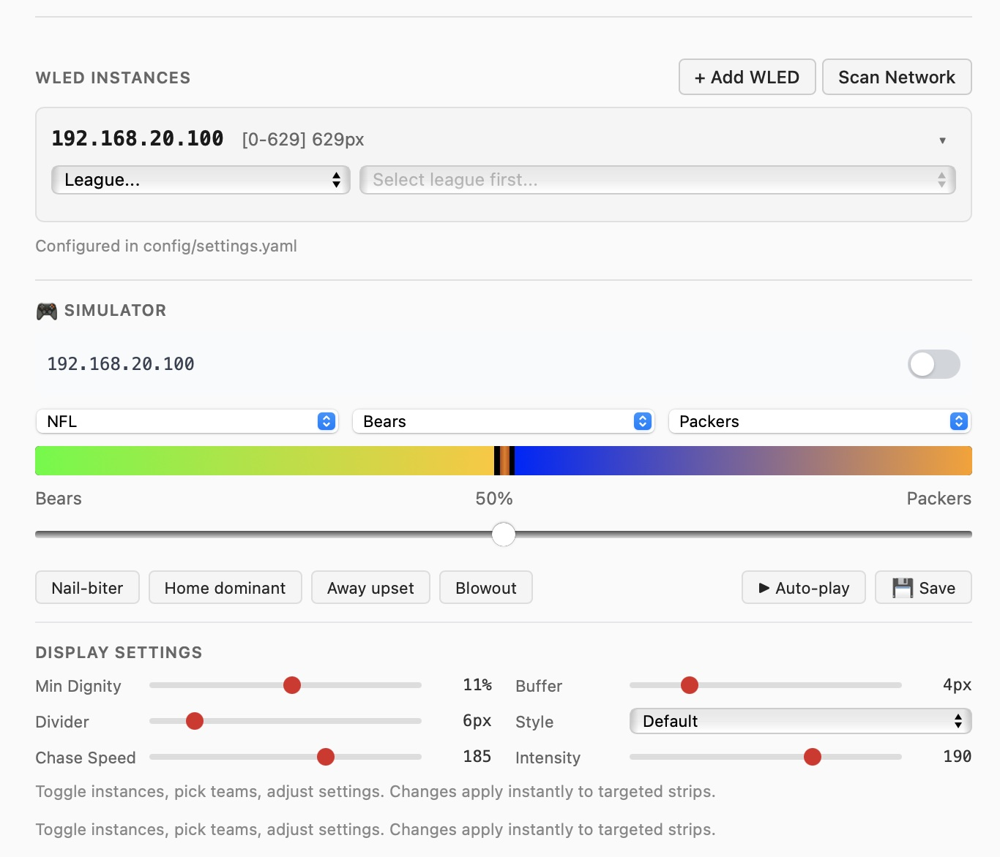

# Scoreline

Live sports win probability visualized on your LED strip.

Scoreline polls ESPN for real-time game data and translates win probability into a dynamic light display on [WLED](https://kno.wled.ge/)-controlled LEDs. Watch the "battle line" shift as momentum swings.



## Features

### Core
- **Real-time win probability** - Polls ESPN every 30 seconds, updates LED segments proportionally
- **5 leagues supported** - NFL, NBA, MLB, NHL, MLS (153 teams total)
- **Multi-instance** - Run different games on different LED strips simultaneously
- **Battle line visualization** - Home/away team colors chase inward toward an animated divider

### Auto-Watch
- **Favorite teams** - Configure teams to watch per WLED instance (e.g., `nfl:GB`, `nba:MIL`)
- **Auto-start** - When your team's game goes live, lights turn on automatically
- **Per-instance** - Each strip can watch different teams

### Post-Game Actions
When a game ends, Scoreline can:
- **Flash winner colors** then fade off (default)
- **Fade off** gracefully
- **Turn off** immediately
- **Restore previous preset** - Returns WLED to whatever was playing before the game
- **Switch to preset** - Jump to a specific WLED preset (stay on)

### Display Customization (Per-Instance)
- **Minimum dignity** - Losing team always keeps at least X% of the strip
- **Dark buffer** - Black pixels separating teams from the battle line
- **Divider size** - Width of the animated center divider
- **Divider style** - Preset animations: default (orange scanner), intense (red fire), ice (blue scanner), pulse (white breathe), chaos (orange strobe)
- **Chase speed & intensity** - Control the team color chase effect

### Simulator
- **Test without live games** - Drag a slider to preview any win percentage
- **Live preview** - See exactly how your LED strip will look before game day
- **Team picker** - Select any two teams from any league
- **Auto-play mode** - Watch it cycle through scenarios automatically

### Quality of Life
- **Preset preservation** - Saves your current WLED state before taking over, can restore after
- **Sync-on-load** - Detects if WLED was changed externally and reflects reality
- **Mini scoreboard** - Live game scores displayed in the web UI per instance
- **Blackout mode** - Pixels outside your configured range go dark during games
- **mDNS discovery** - Auto-find WLED devices on your network
- **Hot-reload config** - YAML changes detected automatically

## Quick Start

### Docker Compose (Recommended)

```yaml
services:
  scoreline:
    image: ghcr.io/jasondostal/scoreline:latest
    container_name: scoreline
    restart: unless-stopped
    ports:
      - "8084:8080"
    volumes:
      - ./config:/app/config
    environment:
      - TZ=America/Chicago
```

```bash
docker compose up -d
# Edit config/settings.yaml with your WLED IP
# Container auto-creates defaults on first run
```

Open `http://localhost:8084` and pick a game.

### Docker Run

```bash
mkdir scoreline && cd scoreline
docker run -d --name scoreline \
  -p 8084:8080 \
  -v ./config:/app/config \
  ghcr.io/jasondostal/scoreline:latest
```

## Configuration

Edit `config/settings.yaml`:

```yaml
wled_instances:
  - host: 192.168.1.100         # Your WLED IP
    start: 0                     # First LED index
    end: 300                     # Last LED index
    watch_teams:                 # Auto-watch these teams (optional)
      - nfl:KC
      - nba:LAL
    display:                     # Per-instance overrides (optional)
      chase_speed: 185
    post_game:                   # What happens when game ends (optional)
      action: restore            # off | fade_off | flash_then_off | restore | preset

poll_interval: 30
auto_watch_interval: 300         # Seconds between auto-watch scans

# Global defaults (all optional - sensible defaults built in)
display:
  divider_preset: classic          # classic | intense | ice | pulse | chaos
  min_team_pct: 0.05
  contested_zone_pixels: 6
  dark_buffer_pixels: 4

post_game:
  action: flash_then_off
  flash_count: 3
  fade_duration_s: 3
```

## Data Directory

First run auto-populates with defaults:

```
config/
├── settings.yaml      # WLED instances, preferences, watch teams
└── leagues/           # League definitions (team colors, ESPN mappings)
    ├── nfl.yaml
    ├── nba.yaml
    ├── mlb.yaml
    ├── nhl.yaml
    └── mls.yaml
```

## Supported Leagues

- NFL (32 teams)
- NBA (30 teams)
- MLB (30 teams)
- NHL (32 teams)
- MLS (29 teams)

League files are YAML - drop in your own to add a league.

## API

| Endpoint | Method | Description |
|----------|--------|-------------|
| `/api/leagues` | GET | List available leagues |
| `/api/games/{league}` | GET | Get live games for a league |
| `/api/instances` | GET | List WLED instances and status |
| `/api/instance/{host}/watch` | POST | Start watching a game |
| `/api/instance/{host}/stop` | POST | Stop watching |
| `/api/instance/{host}/settings` | POST | Update display settings |
| `/api/instance/{host}/watch_teams` | GET/POST | Get/set auto-watch teams |
| `/api/instance/{host}/post_game` | POST | Set post-game action |
| `/api/status` | GET | Current watching status |
| `/api/test` | POST | Test mode - set arbitrary win % |
| `/api/discover` | GET | Scan for WLED devices via mDNS |
| `/api/wled/add` | POST | Add WLED device to config |
| `/api/reload` | POST | Hot-reload config from disk |

## Requirements

- WLED-controlled LED strip
- Network access to WLED device
- Docker or Python 3.11+

## License

MIT

## Acknowledgments

- [WLED](https://kno.wled.ge/) - the LED firmware that makes this possible
- ESPN's scoreboard data (unofficial API)
