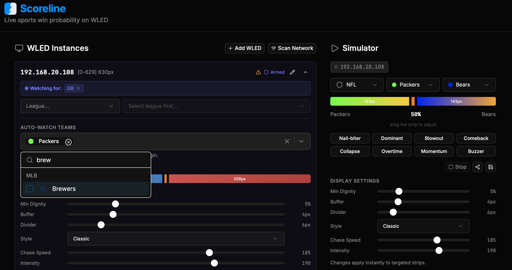

# Scoreline

Live sports win probability visualized on your LED strip.

Scoreline polls ESPN for real-time game data and translates win probability into a dynamic light display on [WLED](https://kno.wled.ge/)-controlled LEDs. Watch the "battle line" shift as momentum swings.



<video src="scoreline-demo.mp4" autoplay loop muted playsinline width="100%"></video>

## Supported Leagues

| League | Teams | | League | Teams |
|--------|------:|-|--------|------:|
| NFL | 32 | | EPL | 20 |
| NBA | 30 | | La Liga | 20 |
| MLB | 30 | | Bundesliga | 18 |
| NHL | 32 | | Serie A | 20 |
| MLS | 30 | | Ligue 1 | 18 |
| WNBA | 15 | | Liga MX | 18 |
| College Football | 500 | | Champions League | 36 |
| Men's College Basketball | 362 | | Women's College Basketball | 361 |

League files are YAML — drop in your own to add a league. Team colors are calibrated for LED saturation.

## Quick Start

```yaml
services:
  scoreline:
    image: ghcr.io/jasondostal/scoreline:latest
    container_name: scoreline
    restart: unless-stopped
    ports:
      - "8084:8080"
    volumes:
      - ./config:/app/config
    environment:
      - TZ=America/Chicago
```

```bash
docker compose up -d
# Edit config/settings.yaml with your WLED IP
# Container auto-creates defaults on first run
```

Open `http://localhost:8084` and pick a game.

<details>
<summary><strong>Features</strong></summary>

### Core
- **Real-time win probability** - WebSocket push updates, falls back to polling automatically
- **Multi-instance** - Run different games on different LED strips simultaneously
- **Battle line visualization** - Home/away team colors chase inward toward an animated divider
- **Win probability sparkline** - SVG chart tracks momentum shifts over the course of a game

### Auto-Watch
- **Favorite teams** - Configure teams to watch per WLED instance (e.g., `nfl:GB`, `nba:MIL`)
- **Auto-start** - When your team's game goes live, lights turn on automatically
- **Priority ordering** - Drag-and-drop to set priority; #1 wins when multiple games start
- **Game cascade** - When a game ends, automatically starts next priority game if available
- **Per-instance** - Each strip can watch different teams

### Post-Game Celebration
Two-phase system when a game ends:

**Phase 1 - Celebration** (in winner colors): Chase, Twinkle, Flash, Solid, or Freeze. Configurable duration (30s to 10+ minutes).

**Phase 2 - After Celebration**: Fade off, Off, Restore previous preset, or switch to a specific WLED preset.

### Display Customization (Per-Instance)
- **Minimum dignity** - Losing team always keeps at least X% of the strip
- **Dark buffer** - Black pixels separating teams from the battle line
- **Divider style** - Preset animations: classic, intense, ice, pulse, chaos
- **Chase speed & intensity** - Control the team color chase effect

### Simulator
- **Draggable strip preview** - Drag directly on the LED preview bar to set win percentage
- **Team picker** - Select any two teams from any league
- **Scenario presets** - Nail-biter, dominant, blowout, comeback, overtime, momentum, buzzer, collapse
- **Share card** - Export a PNG snapshot of your simulation

### Quality of Life
- Toast notifications on every action
- Share cards — export game or sim snapshots as PNG
- Two-column layout on wide screens
- Dismissible watch team badges
- Preset preservation — saves your WLED state, can restore after
- Live scoreboard per instance
- mDNS device discovery
- Hot-reload config (YAML changes detected automatically)
- Instant settings push to WLED

</details>

<details>
<summary><strong>Configuration</strong></summary>

Edit `config/settings.yaml`:

```yaml
wled_instances:
  - host: 192.168.1.100         # Your WLED IP
    start: 0                     # First LED index
    end: 300                     # Last LED index
    watch_teams:                 # Auto-watch these teams (optional)
      - nfl:KC
      - nba:LAL
    display:                     # Per-instance overrides (optional)
      chase_speed: 185
    post_game:                   # What happens when game ends (optional)
      celebration: chase         # freeze | chase | twinkle | flash | solid
      celebration_duration_s: 300  # 5 minutes
      after_action: restore      # off | fade_off | restore | preset

poll_interval: 30
auto_watch_interval: 300         # Seconds between auto-watch scans

# Global defaults (all optional - sensible defaults built in)
display:
  divider_preset: classic        # classic | intense | ice | pulse | chaos
  min_team_pct: 0.05
  contested_zone_pixels: 6
  dark_buffer_pixels: 4

post_game:
  celebration: chase
  celebration_duration_s: 60
  after_action: fade_off
```

### Data Directory

First run auto-populates with defaults:

```
config/
├── settings.yaml      # WLED instances, preferences, watch teams
└── leagues/           # League definitions (team colors, ESPN mappings)
    ├── nfl.yaml       # 16 league files included
    ├── nba.yaml
    ├── ...
    └── ucl.yaml
```

### Docker Run (alternative)

```bash
mkdir scoreline && cd scoreline
docker run -d --name scoreline \
  -p 8084:8080 \
  -v ./config:/app/config \
  ghcr.io/jasondostal/scoreline:latest
```

</details>

<details>
<summary><strong>API</strong></summary>

| Endpoint | Method | Description |
|----------|--------|-------------|
| `/api/leagues` | GET | List available leagues |
| `/api/games/{league}` | GET | Get live games for a league |
| `/api/instances` | GET | List WLED instances and status |
| `/api/instance/{host}/watch` | POST | Start watching a game |
| `/api/instance/{host}/stop` | POST | Stop watching |
| `/api/instance/{host}/settings` | POST | Update display settings |
| `/api/instance/{host}/watch_teams` | GET/POST | Get/set auto-watch teams |
| `/api/instance/{host}/post_game` | POST | Set post-game action |
| `/api/status` | GET | Current watching status |
| `/api/test` | POST | Test mode - set arbitrary win % |
| `/api/discover` | GET | Scan for WLED devices via mDNS |
| `/api/wled/add` | POST | Add WLED device to config |
| `/api/reload` | POST | Hot-reload config from disk |
| `/ws` | WebSocket | Real-time instance updates (auto-reconnect) |

</details>

<details>
<summary><strong>Tech Stack</strong></summary>

- **Backend**: Python 3.12, FastAPI, uvicorn, httpx
- **Frontend**: React 19, TypeScript, Vite, Tailwind v4, shadcn/ui
- **Config**: YAML with hot-reload (watchdog)
- **Discovery**: zeroconf (mDNS)
- **Container**: Multi-stage Docker build (Node + Python)

### Requirements
- WLED-controlled LED strip
- Network access to WLED device
- Docker or Python 3.12+

</details>

## License

GPL-3.0 - See [LICENSE](LICENSE) for details.

## Acknowledgments

- [WLED](https://kno.wled.ge/) - the LED firmware that makes this possible
- ESPN's scoreboard data (unofficial API)
